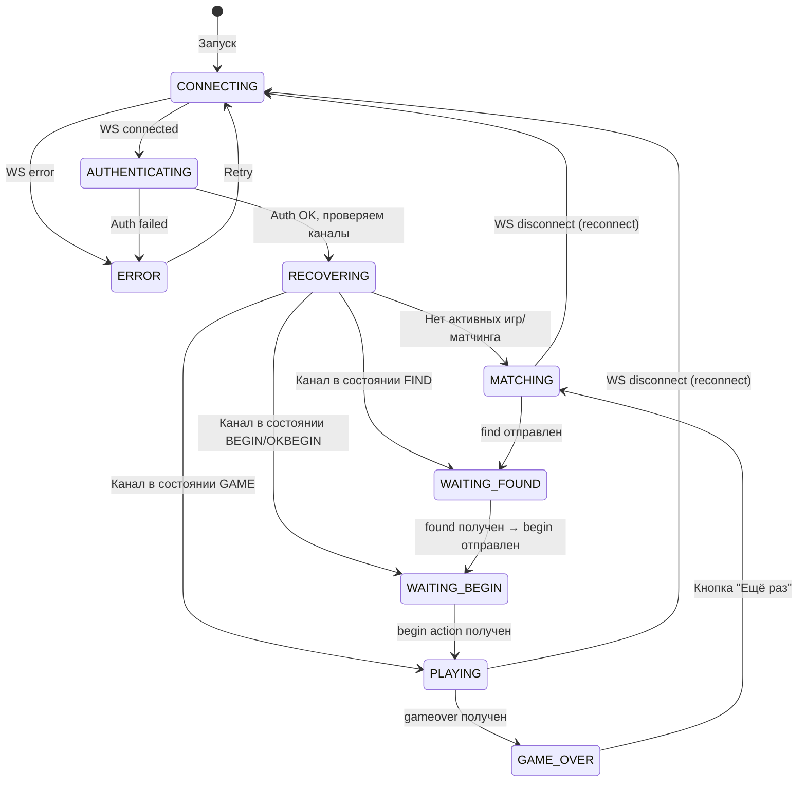
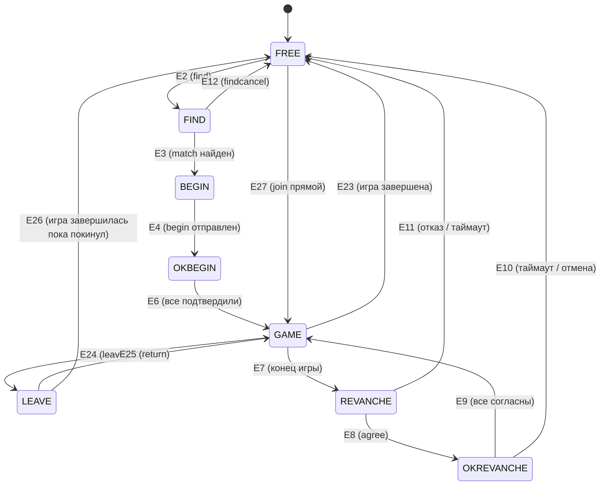

# Минималистичный клиент — Игра «Дурак» (MVP)

> **Цель:** Разработан минимальный WEB SPA клиент для карточной игры «Дурак» (подкидной, 2 игрока) с подключением к рабочему бекенду `wss://gs-ru-sg.globo.games/proto`.

---

## 1. Общие параметры

| Параметр             | Значение                                |
|----------------------|-----------------------------------------|
| Язык                 | TypeScript (strict mode)                |
| Платформа            | Web / Mobile Web                        |
| UI-фреймворк         | React 19 + Vite                        |
| Транспорт            | WebSocket (native `WebSocket` API)      |
| Формат протокола     | XML (DOMParser + свой XML builder)      |
| Авторизация          | Demo (token-less, cookie-based)         |
| Режим игры (MVP)     | `game_mode=0` — Подкидной дурак         |
| Кол-во игроков (MVP) | 2                                       |
| Бекенд               | `wss://gs-ru-sg.globo.games/proto`      |
| На бекенде           | Запущены боты для тестирования           |
| Стиль кода           | Entity per file, максимальная декомпозиция |

---

## 2. Архитектура: Сущности и библиотеки

### 2.1 Реализованные библиотеки (npm packages в monorepo)

Выделены **4 переиспользуемые библиотеки** + **1 приложение**:

| Библиотека                | Назначение                                                                   | Переиспользование                  |
|---------------------------|------------------------------------------------------------------------------|------------------------------------|
| `@updau/transport`        | WebSocket-обёртка: подключение, реконнект, отправка/получение raw-сообщений  | Любая игра / любой клиент UpDAU    |
| `@updau/protocol`         | XML сериализация/десериализация, модели сообщений (Request/Response/Action/Pack), все общие команды (auth, open, find, begin, ping, games, и т.д.) | Любая игра / любой клиент UpDAU    |
| `@updau/core`             | Каналы, состояния каналов (state machine), матчинг, сессия пользователя, восстановление состояния, кошелёк | Любая игра / любой клиент UpDAU    |
| `@updau/durak`            | Игровая логика «Дурак»: модели карт, game state, обработка игровых событий, availables | Клиент «Дурак»                     |
| `durak-client` (app)      | React SPA — UI, маршрутизация состояний, рендер стола, взаимодействие с пользователем | —                                  |

### 2.2. Список сущностей

```
@updau/transport
├── WebSocketTransport       # Управление WS-соединением (connect, disconnect, send, onMessage, onError, onClose)
├── ConnectionState          # Enum: CONNECTING, CONNECTED, DISCONNECTING, DISCONNECTED
├── ReconnectStrategy        # Логика auto-reconnect (backoff)
└── TransportEvents          # Типизированные события транспорта

@updau/protocol
├── xml/
│   ├── XmlParser            # Обёртка DOMParser → типизированные модели
│   └── XmlBuilder           # Построение XML-строк из моделей
├── messages/
│   ├── MessageType          # Enum: REQUEST, RESPONSE, ACTION, PACK
│   ├── Request              # <request cmd="" pub="" sign="">
│   ├── Response             # <response cmd="" pub="" sign="">
│   ├── Action               # <action cmd="" pub="">
│   └── Pack                 # <pack> — группа сообщений
├── commands/
│   ├── AuthCommand          # cmd="auth" (все схемы, для MVP — demo)
│   ├── OpenCommand          # cmd="open"
│   ├── PingCommand          # cmd="ping"
│   ├── GamesCommand         # cmd="games"
│   ├── FindCommand          # cmd="find"
│   ├── FindCancelCommand    # cmd="findcancel"
│   ├── BeginCommand         # cmd="begin"
│   ├── GameCommand          # cmd="game" (обёртка для игровых команд)
│   ├── DetachCommand        # cmd="detach"
│   ├── GetWalletCommand     # cmd="getwallet"
│   ├── GetProfileCommand    # cmd="getprofile"
│   ├── LeaveCommand         # cmd="leave"
│   └── ReturnCommand        # cmd="return"
├── models/
│   ├── UserInfo             # <userinfo uid="" nickname="" lvl="" exp="" token="">
│   ├── ChannelInfo          # <channel pub="" tag=""><state ...></channel>
│   ├── GameInfo             # <gameinfo id="" name="" tableId="" bet="" points="" gameType="" [currency=""]>
│   ├── PlayerInfo           # <player uid="" box="" nick="" level="" avatar="" timeBank="" timeBankTick="">
│   ├── WalletInfo           # <wallet id="" value="" currency="" type="" info="" amount="">
│   ├── Criteria             # <criteria game="" currency="" players="" bet="">
│   ├── WaitInfo             # <wait name="" box="" uid="" tick="" value="" timeBank="">
│   ├── GameDefinition       # <game name="" alias="" min_players="" max_players="">
│   ├── GameType             # <type name="" view=""> (вложен в GameDefinition)
│   ├── BetOption            # <option default="" view="">
│   └── CriteriaOption       # <var name="" view=""><option ...>
└── events/
    ├── AuthEvent            # action cmd="auth" (параллельная авторизация)
    ├── FoundEvent           # action cmd="found"
    ├── BeginEvent           # action cmd="begin"
    ├── StateEvent           # action cmd="state"
    ├── WalletEvent          # action cmd="wallet"
    ├── GameOverEvent        # action cmd="gameover"
    ├── PartyEndEvent        # action cmd="partyend"
    ├── WaitEvent            # action cmd="wait"
    ├── WaitResetEvent       # action cmd="waitreset"
    ├── WaitStopEvent        # action cmd="waitstop"
    ├── TimeoutEvent         # action cmd="timeout"
    ├── TimerStartEvent      # action cmd="timerstart"
    └── TimerStopEvent       # action cmd="timerstop"

@updau/core
├── session/
│   ├── Session              # Управление сессией пользователя (auth → user + token + channels)
│   ├── AuthCredentials      # Параметры авторизации (demo: type, platform, bundle, cookie, wallet)
│   └── DemoAuth             # Конкретная реализация demo-авторизации
├── channel/
│   ├── Channel              # Канал: pub, tag, state, привязка к transport
│   ├── ChannelState         # Enum: FREE, FIND, BEGIN, OKBEGIN, GAME, LEAVE, REVANCHE, OKREVANCHE, WATCH, SUBSCRIBED, CHAT, TAKETURN, TAKEPLACE
│   └── ChannelManager       # Управление каналами (open, detach; восстановление при auth)
├── matching/
│   ├── MatchingService      # Логика матчинга: find → found → begin → game
│   └── MatchingCriteria     # Критерии поиска (game_type, num_seats, bet)
├── state/
│   ├── StateRecovery        # Восстановление состояния: анализ channels после auth/open
│   └── StateMachine         # Базовая state machine для каналов
└── wallet/
    └── Wallet               # Баланс пользователя

@updau/durak
├── models/
│   ├── Card                 # Карта: rank + suit (парсинг "6d" → { rank: 6, suit: "d" })
│   ├── CardRank             # Enum: SIX, SEVEN, EIGHT, NINE, TEN, JACK, QUEEN, KING, ACE
│   ├── CardSuit             # Enum: DIAMONDS, HEARTS, CLUBS, SPADES
│   ├── Box                  # Бокс игрока: id, cardCount, cards(?)
│   ├── TableState           # Состояние стола: trump, deckCount, boxes, attacker, defender
│   ├── GameParams           # <game_param>: timeout, num_seats, points, game_mode
│   ├── AvailableAction      # <available type="" cards="">
│   ├── AvailableActionType  # Enum: READY, FINISH, TAKE, ATTACK, DEFEND, SHOW, TRANS
│   ├── TurnAction           # Enum: ATTACK, DEFEND, SHOW, TRANSFER, TAKE, FINISH
│   ├── TurnInfo             # <turn box="" action="" card="" attack_card="" defend_card="">
│   ├── RoundInfo            # <info attacker="" defender="">
│   ├── GameState            # <gamestate> — полный снимок состояния
│   └── TeamInfo             # <team id="" boxes=""> (на будущее)
├── commands/
│   ├── TurnCommand          # cmd="turn" — формирование игрового хода
│   └── ReadyCommand         # cmd="ready" — готовность к продолжению
├── events/
│   ├── TableEvent           # <table> — начало раунда
│   ├── CardsEvent           # <cards> — карты игрока
│   ├── TurnEvent            # <turn> — уведомление о действии
│   ├── AvailablesEvent      # <availables> — доступные действия
│   ├── FinishRoundEvent     # <finishround> — окончание раунда
│   ├── GameStateEvent       # <gamestate> — восстановление состояния
│   └── WaitEvent            # <wait> — ожидание хода (игровой)
├── DurakGameClient          # Клиент игры: обработка событий, обновление состояния, отправка команд
└── DurakGameController      # Оркестратор: связывает DurakGameClient с Channel и Transport

durak-client (React App)
├── App                      # Корневой компонент, глобальный state
├── hooks/
│   ├── useConnection        # Хук управления WS-подключением
│   ├── useSession           # Хук авторизации и сессии
│   ├── useChannel           # Хук управления каналом
│   ├── useMatching          # Хук матчинга
│   └── useGame              # Хук игровой логики
├── components/
│   ├── ConnectionStatus     # Индикатор подключения
│   ├── MatchingScreen       # Экран поиска игры / ожидания
│   ├── GameTable            # Игровой стол (основной компонент)
│   ├── PlayerHand           # Карты текущего игрока (свои, лицом вверх)
│   ├── OpponentHand         # Карты оппонента (рубашкой вверх, только количество)
│   ├── PlayField            # Поле боя: пары атака-защита
│   ├── CardComponent        # Одна карта (лицо/рубашка)
│   ├── TrumpIndicator       # Козырная масть
│   ├── DeckCounter          # Количество карт в колоде
│   ├── ActionButtons        # Кнопки: "Забрать", "Бито", "Готов"
│   ├── TimerDisplay         # Таймер хода
│   ├── GameOverScreen       # Экран результатов + кнопка "Ещё раз"
│   └── ErrorDisplay         # Отображение ошибок
├── state/
│   ├── AppState             # Enum: CONNECTING, AUTH, RECOVERING, MATCHING, WAITING_BEGIN, PLAYING, GAME_OVER
│   └── appReducer           # Reducer для управления глобальным состоянием
└── assets/
    └── cards/               # SVG-файлы карт
```

---

## 3. Модели из XML-протокола (все entity)

Ниже — полный перечень XML-элементов из протокола, которые преобразованы в TypeScript-модели:

### 3.1 Протокол (общий)

Смотрите документацию по протоколу клиент-сервер: [Протокол клиент-сервер](протокол-клиент-сервер.md) для детального описания всех команд, событий и моделей.

### 3.2 Протокол игры «Дурак»

Смотрите документацию по протоколу игры «Дурак»: [Протокол игры «Дурак»](протокол-игры-дурак.md) для детального описания всех игровых событий, моделей карт, стола, доступных действий и т.д.

### 3.3 Карты

| Модель       | Описание                                                          |
|--------------|-------------------------------------------------------------------|
| `Card`       | `{ rank: CardRank, suit: CardSuit }` + `toString()` → `"6d"`     |
| `CardRank`   | `SIX=6, SEVEN=7, EIGHT=8, NINE=9, TEN=10, JACK=11, QUEEN=12, KING=13, ACE=14` |
| `CardSuit`   | `DIAMONDS="d", HEARTS="h", CLUBS="c", SPADES="s"`                |

Парсинг: `"6d"` → `Card { rank: SIX, suit: DIAMONDS }`, `"10c"` → `Card { rank: TEN, suit: CLUBS }`.

---

## 4. State Machine: Состояния приложения

### 4.1 Состояния приложения (высокоуровневые)



### 4.2 Состояния канала



> **Для MVP:** Используется путь `FREE → FIND → BEGIN → OKBEGIN → GAME → FREE`.

---

## 5. Основной Flow (пошагово)

### 5.1 Запуск и авторизация

```
1. Открываем SPA по URL
2. Генерируем / читаем cookie (уникальный идентификатор пользователя для demo)
   - Если cookie нет → генерировать UUID v4, сохранить в localStorage
3. Подключаемся по WebSocket к wss://gs-ru-sg.globo.games/proto
4. Отправляем auth:
     <request cmd="auth" sign="1">
         <credentials>
             <type value="demo"/>
             <platform value="sa"/>
             <bundle value="com.globogames.skillgames-demo"/>
             <cookie value="{cookie}"/>
         </credentials>
     </request>

5. Получаем response:
    - userinfo (uid, nickname, lvl, exp, token, created, visited)
    - wallets[] — стартовый баланс (value, currency, id)
    - channels[] — список существующих каналов
```

### 5.2 Восстановление состояния

```
6. Анализируем channels из ответа auth:
   - Если есть канал с state="game"  → open этот канал → получаем gamestate → PLAYING
   - Если есть канал с state="find"  → open этот канал → WAITING_FOUND
   - Если есть канал с state="begin" → open этот канал → WAITING_BEGIN
   - Если есть канал с state="okbegin" → open этот канал → WAITING_BEGIN
   - Если есть канал с state="revanche" → open этот канал → отказываемся (cancelrevanche) → FREE
   - Иначе → открываем новый канал (open без pub) → FREE
```

### 5.3 Матчинг

```
7. Канал в состоянии FREE → отправляем find (актуальный формат с очередью):
     <request cmd="find" pub="{channelPub}">
         <queue name="demo_durak">
             <criteria game_type="durak_podkidnoi" cash_bet="100" num_seats="2" points="1"/>
         </queue>
     </request>

8. Ждём action cmd="found":
     <action cmd="found" pub="{channelPub}">
         <criteria game_type="durak_podkidnoi" cash_bet="100" num_seats="2" points="1"
                             rake="10" currency="DEM" type="0" timeout="30" game_mode="0" timebank="60" game="durak"/>
         <players>...</players>
     </action>

9. Отправляем begin (подтверждение готовности):
   <request cmd="begin" pub="{channelPub}"/>

10. Ждём action cmd="begin" (фактический старт игры):
        <action cmd="begin" pub="{channelPub}">
            <gameinfo id="..." name="durak" tableId="..." bet="100" points="1" gameType="durak_podkidnoi"/>
            <self box="0"/>
            <players>...</players>
        </action>
```

### 5.4 Игровой процесс

```
11. Получаем action cmd="game" с блоком:
    - game_param (num_seats, game_mode)
    - table (trump="6s", deck_count, win_card опционально)
12. Получаем cards → отображаем свои карты
    - values = полный набор, add = карты, добранные из колоды
13. Получаем availables → подсвечиваем доступные действия:
    - ATTACK: подсвечиваем карты для атаки, клик = отправить turn action="attack"
    - DEFEND: подсвечиваем пары (атака-защита), клик = отправить turn action="defend"
    - TAKE: показываем кнопку "Забрать"
    - FINISH: показываем кнопку "Бито"
    - READY: показываем кнопку "Готов" (или авто-отправлять)
14. На каждый turn event → обновляем стол (карты на поле боя)
15. На finishround → убираем карты с поля, ждём новый table event
16. На partyend + gameover → отображаем результат (победа/поражение/ничья)
```

### 5.5 Конец игры

```
17. Отображаем GameOverScreen:
    - Результат: Победа / Поражение / Ничья
    - Кнопка "Ещё раз"
    - НЕ предлагаем реванш (сервер присылает wait name="revanche" и action cmd="revanche")
18. По нажатию "Ещё раз":
    - Если канал в revanche → cancelrevanche → ждём перехода в FREE
    - Отправляем find → переходим в MATCHING
```

### 5.6 Reconnect

```
19. При потере WS-соединения:
    - Показываем индикатор "Переподключение..."
    - Exponential backoff retry (1s, 2s, 4s, 8s, max 30s)
    - После reconnect → повторяем auth → восстанавливаем состояние (шаг 5.2)
```

---

## 6. Протокол: Сводка используемых команд

### 6.1 Команды клиента → сервер

| Команда        | Когда                                  | Требует `pub` |
|----------------|----------------------------------------|:---:|
| `auth`         | При подключении                        | ❌ |
| `open`         | Открыть / восстановить канал           | ⚪ (опц.) |
| `ping`         | Keepalive (по таймеру)                 | ❌ |
| `find`         | Начать поиск игры                      | ✅ |
| `findcancel`   | Отмена поиска (при необходимости)      | ✅ |
| `begin`        | Подтвердить готовность к игре           | ✅ |
| `game` (turn)  | Игровой ход (attack/defend/take/finish) | ✅ |
| `game` (ready) | Готовность к следующему этапу           | ✅ |

### 6.2 События сервер → клиент

| Событие        | Содержимое                                  | Реакция клиента                      |
|----------------|---------------------------------------------|--------------------------------------|
| `found`        | criteria, players                           | Отправить `begin`                    |
| `begin`        | gameinfo, self, players                     | Инициализировать игровой стол        |
| `game` (table) | trump, deck_count, boxes, info              | Отрисовать стол, раунд              |
| `game` (cards) | values, add                                 | Обновить руку игрока                 |
| `game` (turn)  | box, action, card(s)                        | Анимировать ход на столе             |
| `game` (availables) | available[]                            | Подсветить доступные действия        |
| `game` (finishround) | —                                     | Завершить визуализацию раунда        |
| `game` (gamestate) | полный снимок                           | Восстановить состояние визуально     |
| `game` (wait)  | name, box, tick, value                      | Обновить таймер                      |
| `game` (info)  | attacker, defender                          | Обновить роли на столе               |
| `gameover`     | box[], place, points, win                   | Показать GameOverScreen              |
| `partyend`     | результаты партии                           | Показать результат партии            |
| `wallet`       | type (BET/WIN/LOSE), value, currency        | Обновить баланс (если отображается)  |
| `state`        | value (новое состояние канала)              | Обновить AppState                    |
| `auth`         | параллельная авторизация                    | Показать предупреждение              |
| `wait`         | ожидание хода                               | Запустить/обновить таймер            |
| `waitstop`     | стоп ожидания                               | Остановить таймер                    |
| `timeout`      | таймаут хода                                | Отобразить таймаут                   |

---

## 7. Ассеты

### 7.1 Карты (36 штук, колода для «Дурак»)

Формат: SVG (векторные, масштабируются под mobile).

| Масть / Ранг   | 6 | 7 | 8 | 9 | 10 | J | Q | K | A |
|----------------|---|---|---|---|-----|---|---|---|---|
| ♦ diamonds (d) | `6d` | `7d` | `8d` | `9d` | `10d` | `Jd` | `Qd` | `Kd` | `Ad` |
| ♥ hearts (h)   | `6h` | `7h` | `8h` | `9h` | `10h` | `Jh` | `Qh` | `Kh` | `Ah` |
| ♣ clubs (c)    | `6c` | `7c` | `8c` | `9c` | `10c` | `Jc` | `Qc` | `Kc` | `Ac` |
| ♠ spades (s)   | `6s` | `7s` | `8s` | `9s` | `10s` | `Js` | `Qs` | `Ks` | `As` |

### 7.2 Дополнительные ассеты

| Ассет                    | Формат | Описание                                 |
|--------------------------|--------|-------------------------------------------|
| Рубашка карты            | SVG    | Одна для всей колоды                     |
| Иконки мастей            | SVG    | ♦ ♥ ♣ ♠ — для индикатора козыря          |
| Фон стола                | CSS/SVG | Зелёный градиент или текстура            |
| Favicon                  | PNG/SVG | 32×32, 16×16                              |

---

## 8. Архитектура файлов и каталогов

См. структуру в репозитории.

## 9. Технические решения

### 9.1 XML ↔ TypeScript

- **Парсинг:** `DOMParser().parseFromString(xml, "text/xml")` → обход DOM → типизированные модели
- **Сборка:** Template literals или builder-паттерн → XML-строка

### 9.2 Cookie / ID пользователя

- Используем `localStorage` с ключом `updau_demo_cookie`
- При первом запуске генерируем `crypto.randomUUID()` (если доступен) или fallback UUID
- Значение используется как `cookie` в `credentials`

### 9.3 Ping / Keepalive

- Отправлять `ping` каждые 30 секунд при открытом WS-соединении

### 9.4 Обработка ошибок

- WS disconnect: Показать overlay "Переподключение...", авто-reconnect
- Auth error: Сгенерировать новый cookie, повторить
- Game error: Показать toast с текстом ошибки
- Timeout: Ничего — сервер сам обработает

---

## 10. Ограничения MVP

- ❌ Переводной дурак (game_mode 1-5)
- ❌ Игра на 3-4 игрока
- ❌ Парный режим (2x2)
- ❌ Реванш (cancelrevanche при получении)
- ❌ Анимации перелёта карт (простое перемещение)
- ❌ Звуки
- ❌ Чат
- ❌ Наблюдение за столами (watch)
- ❌ Лобби / подписка на комнаты
- ❌ Статистика игрока
- ❌ Выбор ставки / критериев (зашиты в коде)
- ❌ Профили игроков
- ❌ Несколько одновременных каналов

---

## 11. Документация

- [Авторизация клиент-сервер](авторизация-клиент-сервер.md)
- [Жизненные циклы](жизненные-циклы.md)
- [Описание игры «Дурак»](описание-игры-дурак.md)
- [Протокол игры «Дурак»](протокол-игры-дурак.md)
- [Протокол клиент-сервер](протокол-клиент-сервер.md)
- [Состояния каналов](состояния-каналов.md)
