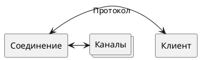
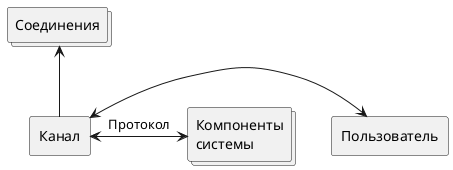
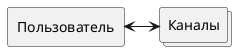
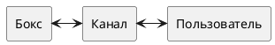
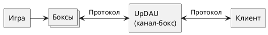

**Жизненные циклы базовых объектов в системе UpDAU**

1. **Описание базовых объектов системы**

 Базовыми объектами в системе UpDAU являются соединение (в некоторых контекстах \- транспорт), канал, пользователь, бокс и игра. Между этими абстракциями существуют зависимости и связи, которые следует учитывать при разработке как компонентов системы, так и клиентского ПО.

1. **Соединение**  
   1. **Описание**

   Соединением (или **транспортом**) в системе может теоретически являться любой канал передачи данных уровней 4-7 по модели OSI. На данный момент рабочими являются соединения на базе WebSocket и TCP (chunked) протоколов.

   Любое соединение в системе может быть связано со списком **каналов**. Связи с другими объектами в системе не являются непосредственными. Например, нельзя сказать, что соединение принадлежит какому-то **пользователю** в системе, так как в списке каналов соединения все каналы могут принадлежать разным пользователям. То же относится к связям с **играми** \- игра не привязывается никак к **соединению**.

   1. **Цикл жизни**

   Время жизни **соединения** в системе в большинстве случаев совпадает с собственным временем жизни соединения. Для протоколов с не постоянным соединением (HTTP) возможны вариации с таймаутами и сессиями. Новое соединение существует в системе без привязки к другим объектам.

   При открытии канала в соединении (команда **open**) соединение связывается с открытым каналом. Эта связь существует до тех пор, пока существует канал или соединение.

   При уничтожении канала (переход в состояние **FREE**) связь соединения и канала также уничтожается. Следует учитывать, что в одном соединении может быть открыто несколько каналов.

   В системе реализованы два типа команд. Первые позволяют получать данные непосредственно через открытое соединение, без авторизации и участия каналов (команды **games**, **ver**, **ping** и другие), вторые требуют указания идентификатора канала или токена авторизации в явном виде (**find**, **subscribe** и другие).

1. **Канал**  
   1. **Описание**

   Канал можно описать, как виртуальное соединение между объектами или компонентами системы, не зависящее от транспорта, принадлежащее конкретному пользователю и находящееся в специфическом состоянии. Канал может как принимать, так и передавать данные. По каналам может происходить общение не только клиент-сервер но и компонент-компонент внутри системы (в общем случае клиент \- тоже компонент системы).

   Каждый канал в системе имеет уникальный идентификатор и привязку к **пользователю** (не существует анонимных каналов). Любой канал в системе может быть привязан к одному и более **соединению**, так что данные, пришедшие в канал будут отосланы во все связанные с ним соединения.

   При открытии канала пользователь также может указать **тег** канала.

   1. **Цикл жизни**

   Канал создается командой **open** и существует в системе до перехода в состояние **FREE** (смотреть состояния каналов) или до уничтожения **пользователя** в системе. Пользователь (клиент) может открыть в системе ограниченное конфигурацией количество каналов (конфигурируется) и использовать их на свое усмотрение.

   Любой цикл жизни канала приводит к автоматическому уничтожению канала при переводе его в состояние **FREE**.

   Существует разница в поведении между вызовом **open** для уже существующего в системе канала и для нового \- в первом случае проверяется принадлежность канала **пользователю** и при успехе канал просто привязывается к еще одному **соединению**, во втором происходит создание и привязка к соединению нового канала в состоянии **FREE**.

   Для канала характерен [набор состояний](https://docs.google.com/document/d/1_l2_RrWKOswCAsGk7NIYMBYbWdDtU7zHlGeIMjSjL2g/) с переходами между ними по соответствующим событиям. Список состояний канала может расширяться.

1. **Пользователь**  
   1. **Описание**

   Пользователь в системе является отражение реального пользователя \- живого человека (иногда бота). Внутри системы пользователь определяется уникальным идентификатором и другими атрибутами.

   Пользователь может быть авторизован различными способами (логин и пароль, идентификатор ВК, идентификатор устройства, список может расширяться), но не смотря на способ авторизации все пользователи существуют в единой среде UpDAU, независимо от того, авторизовался пользователь в ВК или логином и паролем они смогут взаимодействовать (играть) в системе друг с другом.

   Пользователь не работает непосредственно с **соединениями**, так как нет прямой связи пользователь-соединение. Вместо этого пользователь взаимодействует с компонентами системы через список своих **каналов**.

   1. **Цикл жизни**

   Под существованием пользователя в системе подразумевается, что есть некий объект “пользователь”, который может во время своего жизненного цикла взаимодействовать с системой (играть в игры например). Таким образом зарегистрированные и лежащие в базе данных пользователи, несомненно “существуют” но их не существует в системе.

   Пользователь создается в системе в момент авторизации (команда **auth**) и существует в системе до следующих граничных условий:

- ни один канал не находится в состоянии **game, leave**  
- ни один канал пользователя не содержит открытого **соединения**  
- первые два пункта веры на протяжении времени **TTL** (time to live) из конфигурации (120 секунд)  
- счетчик **TTL** сбрасывается при несоблюдении хотя бы одного условия п1 или п2  

1. **Бокс**  
   1. **Описание**

   Боксом в системе UpDAU называется занятое игровое место. При этом место в игре занимает не **пользователь**, а его **канал** (при этом канал обычно находится в состоянии **GAME**). Это позволяет одному **пользователю** в системе играть в несколько **игр** одновременно и легко различать их. Бокс является стандартной абстракцией для описания простых игр, однако его наличие не обязательно.

   1. **Цикл жизни**

   Время жизни бокса ограничено временем нахождения **пользователя** (и его **канала**) в игровом контексте. Каждая конкретная игра определяет время жизни бокса по своим правилам. Решением связей между каналом, пользователем и боксом занимается игровой модуль. Так что непосредственно **игра** строит свою логику, пользуясь **боксами**, а бизнес логика системы строится на работе с **каналами**.

1. **Игра**  
   1. **Описание**

   Игра является воплощением игровой логики в рамках UpDAU. Количество **пользователей** в игре определяется правилами конкретной игры и может различаться и изменяться во время игрового процесса (частный случай \- покер). Пользователь в игре представлен **боксом** (большинство) или непосредственно **пользователем** (покер). Общение с другими компонентами системы происходит или посредством каналов или при помощи скрытых внутренних механизмов.

   Для клиента **игра** привязывается к **каналу**, при этом канал обычно находится в состоянии **GAME**.

   1. **Цикл жизни**

   Игры являются объектами со сложным поведением. В общем случае игра может быть создана или самой системой (например при быстром поиске через команду **find**) или по запросу **пользователя** (покер,слоты). Время жизни игры определяется правилами игры.
