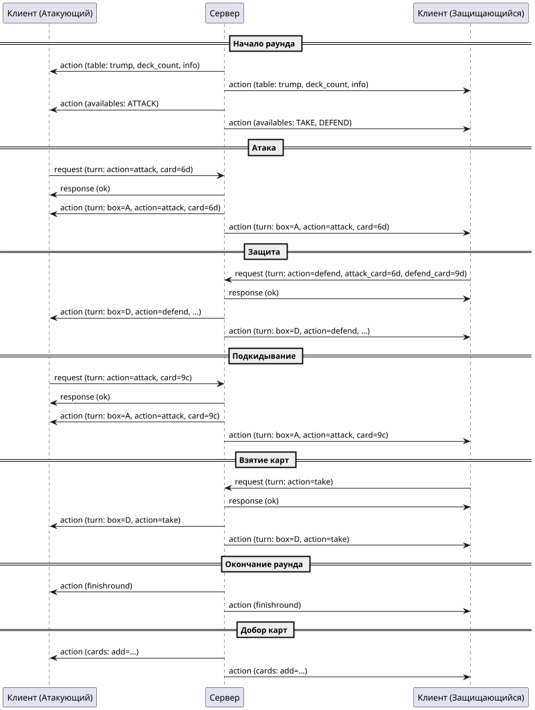

# Протокол игры "Дурак"

Этот документ описывает специфичные для игры "Дурак" команды и события, передаваемые по протоколу UpDAU. Общие принципы обмена сообщениями описаны в документе [Протокол клиент-сервер](протокол-клиент-сервер.md).

## Оглавление

- [Настройки игры (Conventions)](#настройки-игры-conventions)
- [Режимы игры](#режимы-игры)
- [Команды клиента](#команды-клиента)
  - [turn - Игровое действие](#turn---игровое-действие)
  - [ready - Готовность к продолжению](#ready---готовность-к-продолжению)
- [События от сервера](#события-от-сервера)
- [Жизненный цикл раунда](#жизненный-цикл-раунда)

---

## Настройки игры (Conventions)

Настройки игры передаются в элементе **game_param** и определяют правила текущей партии.

| Параметр | Диапазон/Значения | Описание |
|----------|-------------------|----------|
| **timeout** | 0-999 | Время на ход игрока (секунды) |
| **num_seats** | 2-6 | Количество игроков за столом |
| **points** | 0-999 | Количество очков для окончания игры (0 = без ограничения) |
| **game_mode** | 0-5 | Режим игры (см. таблицу ниже) |
| **deck** | строка | (только для тестирования) Карты, раздаваемые игрокам |

### Режимы игры

| Код | Название | Описание |
|-----|----------|----------|
| **0** | Обычный дурак | Каждый играет сам за себя, без перевода карт |
| **1** | Переводной дурак (без светофора) | Возможность перевести карты на следующего игрока без предупреждения |
| **2** | Переводной дурак (со светофором) | Защищающийся показывает карту перед переводом (команда `show`) |
| **3** | Игра на пары | Игроки разделены на команды, обычные правила |
| **4** | Игра на пары (переводной без светофора) | Командная игра с возможностью перевода |
| **5** | Игра на пары (переводной со светофором) | Командная игра с обязательным показом карты перед переводом |

**Пример:**

```xml
<game_param num_seats="4" game_mode="2" timeout="30" points="0">
    <deck>6d,7h,8s,9c,10d,Jh,Qs,Kc,Ad</deck>
</game_param>
```

---

## Команды клиента

Все игровые команды отправляются с использованием обертки `cmd="game"` в контексте открытого канала. Подробнее о структуре команд см. [Протокол клиент-сервер](протокол-клиент-сервер.md#game-игровой-протокол).

### turn - Игровое действие

Команда **turn** используется для выполнения всех игровых действий: атаки, защиты, перевода, взятия карт и завершения раунда.

#### Общий формат запроса

```xml
<request cmd="game" pub="xxx">
    <game cmd="turn">
        <turn action="ACTION_TYPE" [card="CARD"] [attack_card="CARD"] [defend_card="CARD"] />
    </game>
</request>
```

#### Возможные ответы

**Успех:**

```xml
<response cmd="game" pub="xxx">
    <!-- Событие turn с информацией о совершенном действии -->
    <turn box="X" action="ACTION_TYPE" ... />
    <!-- Информация о доступных ходах -->
    <availables>
        <available type="..." cards="..." />
    </availables>
</response>
```

**Ошибка:**

```xml
<response cmd="game" pub="xxx">
    <error>Описание ошибки</error>
</response>
```

---

### Типы действий (action)

#### 1. attack - Атака / Подкидывание карты

Положить карту для начала атаки или подкинуть дополнительную карту к существующей атаке.

**Запрос:**

```xml
<request cmd="game" pub="xxx">
    <game cmd="turn">
        <turn action="attack" card="6d" />
    </game>
</request>
```

**Параметры:**

- **card** — карта для атаки (формат: ранг + масть, например `6d` = шестерка бубен)

**Когда использовать:**

- Атакующий начинает первый ход в раунде
- Любой игрок (кроме отбивающегося) подкидывает карту

---

#### 2. defend - Защита / Отбивание карты

Положить карту для отбивания атакующей карты.

**Запрос:**

```xml
<request cmd="game" pub="xxx">
    <game cmd="turn">
        <turn action="defend" attack_card="6d" defend_card="9c" />
    </game>
</request>
```

**Параметры:**

- **attack_card** — карта противника, которую отбивают
- **defend_card** — карта игрока, которой отбивают

**Правила отбивания:**

- Карта должна быть старше по рангу той же масти
- Или любой козырь бьёт некозырную карту
- Больший козырь бьёт меньший козырь

---

#### 3. show - Показ карты (светофор)

Показать карту для намерения перевести атаку. Используется в режимах с **светофором** (`game_mode` = 2 или 5).

**Запрос:**

```xml
<request cmd="game" pub="xxx">
    <game cmd="turn">
        <turn action="show" card="6h" />
    </game>
</request>
```

**Параметры:**

- **card** — карта того же ранга, что и атакующая

**Когда использовать:**

- Защищающийся хочет перевести карту в режиме со светофором
- После показа игрок должен выполнить команду `transfer`

---

#### 4. transfer - Перевод атаки

Переводит атаку на следующего игрока, подкинув карту того же ранга.

**Запрос:**

```xml
<request cmd="game" pub="xxx">
    <game cmd="turn">
        <turn action="transfer" card="6h" />
    </game>
</request>
```

**Параметры:**

- **card** — карта того же ранга, что и атакующая

**Режимы использования:**

- В переводном дураке **без светофора** — сразу переводит
- В переводном дураке **со светофором** — после команды `show`

---

#### 5. take - Взятие карт

Отбивающийся забирает все карты со стола (не может или не хочет отбиваться).

**Запрос:**

```xml
<request cmd="game" pub="xxx">
    <game cmd="turn">
        <turn action="take" />
    </game>
</request>
```

**Параметры:** отсутствуют

**Последствия:**

- Все карты с игрового стола переходят в руку отбивающегося
- Раунд завершается
- Следующий ход начинает игрок слева от взявшего карты

---

#### 6. finish - Завершение раунда

Игроки соглашаются завершить раунд. Используется, когда атакующие не хотят больше подкидывать карты.

**Запрос:**

```xml
<request cmd="game" pub="xxx">
    <game cmd="turn">
        <turn action="finish" />
    </game>
</request>
```

**Параметры:** отсутствуют

**Условия:**

- Все атакующие карты отбиты
- Атакующие больше не хотят подкидывать
- **Отбивающийся НЕ посылает эту команду** — он ждёт, пока атакующие закончат

---

### ready - Готовность к продолжению

Клиент сигнализирует о готовности перейти к следующему этапу игры (например, к раздаче карт из колоды).

**Запрос:**

```xml
<request cmd="game" pub="xxx">
    <game cmd="ready" />
</request>
```

**Ответ (успех):**

```xml
<response cmd="game" pub="xxx">
    <ok />
</response>
```

**Ответ (ошибка):**

```xml
<response cmd="game" pub="xxx">
    <error>Описание ошибки</error>
</response>
```

**Примечание:** Команда опциональна. Если клиент не отправляет `ready`, игра автоматически перейдёт к следующему этапу по истечении таймаута.

---

## События от сервера

События приходят клиенту асинхронно в формате `<action cmd="..." pub="...">` или внутри ответов на команды.

В актуальной реализации игровые события приходят внутри `action cmd="game"` и могут содержать несколько вложенных блоков одновременно:

```xml
<action cmd="game" pub="xxx">
    <game_param num_seats="2" game_mode="0" />
    <table trump="6s" deck_count="24" win_card="7s">...</table>
    <cards values="Jc,Kh,7h,6c,8d,6h" add="Jc,Kh,7h,6c,8d,6h" />
    <turn box="1" action="attack" card="9d" />
    <availables>...</availables>
    <finishround />
    <gamestate>...</gamestate>
    <event box="0" name="ready" />
    <wait name="turn" tick="0" value="15" box="1" timeBank="60" />
</action>
```

### turn - Уведомление о действии игрока

Информирует всех участников о совершённом действии.

**Формат:**

```xml
<turn box="X" action="ACTION_TYPE" [card="CARD"] [attack_card="CARD"] [defend_card="CARD"]>
    <info attacker="A" defender="D" />
</turn>
```

**Атрибуты:**

| Атрибут | Описание | Возможные значения действий |
|---------|----------|----------------------------|
| **box** | Идентификатор бокса (места игрока) | Число (0-N) |
| **action** | Тип действия | `attack`, `defend`, `show`, `transfer`, `take`, `finish` |
| **card** | Карта, которой совершено действие | Присутствует в: `attack`, `show`, `transfer` |
| **attack_card** | Карта атакующего | Присутствует в: `defend` |
| **defend_card** | Карта, которой отбили | Присутствует в: `defend` |

**Вложенный элемент `<info>`:**

```xml
<info attacker="X" defender="Y" />
```

- **attacker** — идентификатор бокса атакующего
- **defender** — идентификатор бокса защищающегося

---

### availables - Доступные действия

Информирует клиента о том, какие кнопки/действия сейчас доступны игроку.

**Формат:**

```xml
<availables>
    <available type="TYPE" [cards="CARDS_LIST"] />
    ...
</availables>
```

| Тип (type) | Атрибут cards | Описание |
|------------|---------------|----------|
| **READY** | отсутствует | Можно перейти к следующему этапу (раздача карт и т.д.) |
| **FINISH** | отсутствует | Завершить текущий раунд (для атакующих) |
| **TAKE** | отсутствует | Забрать карты (для отбивающегося) |
| **ATTACK** | `c1-c2,c3-c4,...` | Атаковать или подкинуть карту. Формат: `<к чему подкинуть>-<чем подкинуть>` |
| **DEFEND** | `c1-c2,c3-c4,...` | Отбить карту. Формат: `<что отбить>-<чем отбить>` |
| **SHOW** | `c1,c2,...` | Показать карту для перевода (светофор) |
| **TRANS** | `c1,c2,...` | Перевести карту на следующего игрока |

**Примеры формата атрибута `cards`:**

- `cards="6d,7h"` — доступные карты для показа/перевода
- `cards="6d-7d,6d-8d"` — можно отбить 6♦ семёркой или восьмёркой бубен
- `cards="6d-7h,9c-Qs"` — можно подкинуть 7♥ к 6♦ или Q♠ к 9♣

---

### table - Начало раунда

Событие, информирующее о начале нового раунда игры.

**Формат:**

```xml
<table trump="TRUMP_CARD" deck_count="N" [win_card="CARD"]>
    <box id="X" count="Y" [add="CARDS"] />
    ...
    <info attacker="A" defender="D" />
    [<teams>...</teams>]
</table>
```

**Атрибуты `<table>`:**

- **trump** — козырная карта (например, `Ks` = козырный король пик)
- **deck_count** — количество карт, оставшихся в колоде
- **win_card** — карта победителя (опционально, на этапе завершения игры)

**Элемент `<box>`:**

- **id** — идентификатор бокса игрока
- **count** — количество карт на руках у игрока
- **add** — количество добранных карт из колоды (опционально)

**Элемент `<info>`:**

- **attacker** — идентификатор бокса атакующего
- **defender** — идентификатор бокса защищающегося

---

### cards - Карты игрока

Информирует о картах текущего игрока (клиента).

**Формат:**

```xml
<cards [values="CARDS"] [add="CARDS"] />
```

**Атрибуты:**

- **values** — текущие карты на руках (например: `6d,7h,8s,Kc,Ah`)
- **add** — карты, которые были добавлены из колоды (список карт)

---

### info - Информация об атакующем и защищающемся

Уведомление о смене ролей игроков.

**Формат:**

```xml
<info attacker="X" defender="Y" />
```

**Атрибуты:**

- **attacker** — идентификатор бокса атакующего игрока
- **defender** — идентификатор бокса защищающегося игрока

---

### finishround - Окончание раунда

Событие об окончании текущего раунда.

**Формат:**

```xml
<finishround />
```

---

### teams - Команды игроков

Информация о командах (для режимов `game_mode` = 3, 4, 5).

**Формат:**

```xml
<teams>
    <team id="A" boxes="0,2" />
    <team id="B" boxes="1,3" />
</teams>
```

**Атрибуты `<team>`:**

- **id** — идентификатор команды (обычно "A" или "B")
- **boxes** — список идентификаторов боксов (мест игроков), входящих в команду

---

### gamestate - Снимок состояния игры

Полный снимок текущего состояния игры. Используется при переподключении или восстановлении после сбоя.

**Формат:**

```xml
<gamestate>
    [<teams>...</teams>]
    <table>
        <cards value="HAND_CARDS" deck_count="N" trump="TRUMP" deckRelease="BOOL">
            <box id="X" count="Y" />
            ...
        </cards>
    </table>
    <availables>...</availables>
    <player cards="HAND_CARDS" />
    <info attacker="A" defender="D" />
    <game_param num_seats="N" game_mode="M" [deck="..."] />
</gamestate>
```

**Элементы:**

- `<teams>` — информация о командах (если игра командная)
- `<table>` — состояние стола
- `<availables>` — доступные действия игрока
- `<player>` — карты игрока
- `<info>` — роли игроков
- `<game_param>` — параметры игры

---

### event - Событие от пользователя (для синхронизации)

Информирует о событии от конкретного игрока.

**Формат:**

```xml
<event name="EVENT_NAME" box="X" />
```

**Возможные значения `name`:**

- **ready** — игрок готов перейти к следующей стадии игры

---

### wait - Состояние ожидания

Информация о текущем активном ожидании (таймере).

**Возможные значения:**

- **ready** — ожидание подтверждения готовности от клиентов
- **turn** — ожидание хода от конкретного игрока

**Формат:**

```xml
<wait name="TYPE" box="X" tick="CURRENT" value="TOTAL" />
```

**Атрибуты:**

- **name** — тип ожидания (`ready` или `turn`)
- **box** — идентификатор бокса игрока (для `turn`)
- **tick** — текущее значение таймера (миллисекунды)
- **value** — максимальное значение таймера (миллисекунды)

---

## Жизненный цикл раунда

Ниже представлена упрощённая диаграмма последовательности действий в типичном раунде игры "Дурак".



---

## Формат обозначения карт

Карты обозначаются двухсимвольным форматом: **[РАНГ][МАСТЬ]**

### Ранги

- **6-9**: цифры от 6 до 9
- **10**: десятка (может быть обозначена как `10` или `T`)
- **J**: валет (Jack)
- **Q**: дама (Queen)
- **K**: король (King)
- **A**: туз (Ace)

### Масти

- **d**: бубны (diamonds) ♦
- **h**: червы (hearts) ♥
- **c**: трефы (clubs) ♣
- **s**: пики (spades) ♠

**Примеры:**

- `6d` — шестёрка бубен
- `Ah` — туз червей
- `Ks` — король пик
- `10c` — десятка треф

---

## Примеры сценариев

### Сценарий 1: Успешное отбивание

1. Сервер начинает раунд:

```xml
<action cmd="game" pub="123">
    <table trump="Ks" deck_count="24">
        <box id="0" count="6" />
        <box id="1" count="6" />
        <info attacker="0" defender="1" />
    </table>
    <cards values="6d,7d,8h,9c,Jh,Qd" />
    <availables>
        <available type="ATTACK" cards="6d-6d,7d-7d,8h-8h,9c-9c,Jh-Jh,Qd-Qd" />
    </availables>
</action>
```

1. Атакующий (бокс 0) ходит:

```xml
<request cmd="game" pub="123">
    <game cmd="turn">
        <turn action="attack" card="6d" />
    </game>
</request>
```

1. Защищающийся (бокс 1) отбивается:

```xml
<request cmd="game" pub="123">
    <game cmd="turn">
        <turn action="defend" attack_card="6d" defend_card="Kd" />
    </game>
</request>
```

1. Атакующий завершает раунд:

```xml
<request cmd="game" pub="123">
    <game cmd="turn">
        <turn action="finish" />
    </game>
</request>
```

---

### Сценарий 2: Перевод со светофором

1. Атакующий ходит картой `6d`

2. Защищающийся показывает карту для перевода:

```xml
<request cmd="game" pub="123">
    <game cmd="turn">
        <turn action="show" card="6h" />
    </game>
</request>
```

1. Сервер подтверждает показ:

```xml
<action cmd="game" pub="123">
    <turn box="1" action="show" card="6h" />
    <availables>
        <available type="TRANS" cards="6h" />
    </availables>
</action>
```

1. Защищающийся переводит карту:

```xml
<request cmd="game" pub="123">
    <game cmd="turn">
        <turn action="transfer" card="6h" />
    </game>
</request>
```

1. Атака переходит к следующему игроку

---

### Сценарий 3: Взятие карт

1. Атакующие подкидывают карты

2. Защищающийся не может/не хочет отбиваться:

```xml
<request cmd="game" pub="123">
    <game cmd="turn">
        <turn action="take" />
    </game>
</request>
```

1. Сервер уведомляет всех о взятии:

```xml
<action cmd="game" pub="123">
    <turn box="1" action="take" />
    <finishround />
    <cards values="6d,7d,8h,9c,Jh,Qd,6h,7c" add="6h,7c" />
</action>
```

---

## Связанные документы

- [Протокол клиент-сервер](протокол-клиент-сервер.md) — общие команды и структура протокола
- [Состояния каналов](состояния-каналов.md) — жизненный цикл каналов и переходы между состояниями
- [Жизненные циклы](жизненные-циклы.md) — описание базовых объектов системы UpDAU

---

## Дополнительные примечания

### Обработка ошибок

При отправке некорректной команды (например, попытка отбить карту, которой нет на руках) сервер вернёт ошибку:

```xml
<response cmd="game" pub="123">
    <error>Card not found in hand</error>
</response>
```

### Режим отладки

В тестовой среде можно использовать параметр `deck` в `game_param`, чтобы задать конкретные карты для раздачи. Это позволяет воспроизводить специфичные игровые ситуации.

### Таймауты

Если игрок не делает ход в течение времени `timeout`, сервер может автоматически выполнить действие за него или применить штрафные санкции в зависимости от конфигурации игры.
