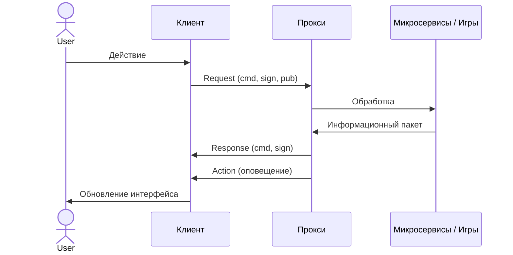
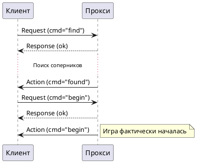

# Протокол Клиент-Сервер UpDAU

В данном документе описывается протокол взаимодействия между клиентским программным обеспечением и сервером (Прокси) системы UpDAU.

## Основные понятия

* **Клиент** — программный комплекс, реализующий логику на стороне пользователя.
* **Канал** — виртуальная сущность, идентифицируемая уникальным ключом (`pub`), предназначенная для управления состояниями и идентификации данных. См. [Состояния каналов](состояния-каналов.md).
* **Прокси** — серверный компонент, обеспечивающий работу с пользователями, транспортом и каналами, а также маршрутизацию запросов.
* **Стол** — "игровое окружение", модель, реализующая логику конкретного игрового стола. Стол связан с игрой, которая обрабатывает сообщения и рассылает оповещения участникам.
* **Участники** — каналы, присоединенные к столу. Все участники получают оповещения о событиях.
* **Боксы** — посадочные места за столом (нумерация с 0).
* **Игровые критерии** — набор параметров (ключ-значение), описывающих правила и условия игры (ставка, количество игроков и т.д.).

Подробное описание жизненных циклов этих объектов доступно в документе [Жизненные циклы](жизненные-циклы.md).

## Схема взаимодействия



## Формат сообщений

Обмен данными может происходить в формате **XML** или **JSON**. Поддерживаются три типа сообщений: запрос, ответ и оповещение.

### Request (Запрос)

Отправляется клиентом серверу.

```xml
<request cmd="..." [pub="..."] [sign="..."]>
    [content]
</request>
```

* **cmd** — имя команды.
* **pub** — идентификатор канала (необязателен для общих команд).
* **sign** — произвольная метка для отслеживания асинхронного ответа.
* **content** — тело команды (обычно XML-структура).

### Response (Ответ)

Отправляется сервером в ответ на конкретный запрос.

```xml
<response cmd="..." [pub="..."] [sign="..."]>
    [content]
</response>
```

Атрибуты `pub` и `sign` соответствуют значениям из запроса.

### Action (Оповещение)

Асинхронное сообщение от сервера, не привязанное к конкретному запросу.

```xml
<action cmd="..." pub="...">
    [content]
</action>
```

### Pack (Пакет сообщений)

Сервер или клиент могут группировать сообщения для последовательной обработки.

```xml
<pack>
    <response ... />
    <action ... />
    ....
</pack>
```

## Общие команды (без привязки к каналу)

### PING (Проверка соединения)

Позволяет проверить активность соединения и замерить задержку.

**Запрос:**

```xml
<request cmd="ping" [sign="xxx"]>arbitrary data</request>
```

**Ответ:**

```xml
<response cmd="ping" [sign="xxx"]>arbitrary data</response>
```

### VER (Версия сервера)

Возвращает информацию о версии сборки прокси-сервера.

**Запрос:**

```xml
<request cmd="ver" [sign="xxx"]/>
```

**Ответ:**

```xml
<response cmd="ver" [sign="xxx"]>
    <version>2.0</version>
    <build>1.0.6451.33774</build>
</response>
```

### GAMES (Доступные игры)

Возвращает список игр и их настроек (конвенций), доступных для матчинга.

**Запрос:**

```xml
<request cmd="games" [sign="xxx"]/>
```

**Ответ:**

```xml
<response cmd="games" [sign="xxx"]>
    <game name="durak" alias="durak" min_players="2" max_players="4">
        <type name="durak_podkidnoi" view="Дурак подкидной">
            <bet>
                <currency name="FUN">
                    <option default="true" view="100 фишек">100</option>
                    <option view="300 фишек">300</option>
                </currency>
            </bet>
            <criterias>
                <var name="num_seats" view="Количество игроков">
                    <option default="true" view="2">2</option>
                    <option view="3">3</option>
                    <option view="4">4</option>
                </var>
            </criterias>
        </type>
    </game>
</response>
```

### AUTH (Авторизация)

Авторизация пользователя в системе. Используется токен, полученный на White Label (WL).

**Запрос:**

```xml
<request cmd="auth" [sign="xxx"]>
    <platform value="web" />
    <bundle value="com.globo.durak" />
    <token value="AUTH_TOKEN_HERE" />
</request>
```

**Ответ (успех):**

```xml
<response cmd="auth" [sign="xxx"]>
    <user>
        <userinfo uid="123" nickname="Player1" lvl="5" exp="1500" token="TOKEN" created="1700000000" visited="1700000100" />
    </user>
    <wallets>
        <wallet id="wallet-1" value="5000" currency="DEM" />
    </wallets>
    <channels>
        <channel pub="1" tag="main">
            <state value="free" />
        </channel>
    </channels>
</response>
```

* `channels` — содержит список уже открытых каналов пользователя (если есть).

**Ответ (ошибка):**

```xml
<response cmd="auth" [sign="xxx"]>
    <error code="401">Invalid token</error>
</response>
```

### USERS (Игроки онлайн)

Возвращает список игроков в сети с их статусами (играют, наблюдают, ищут игру).

**Запрос:**

```xml
<request cmd="users" [sign="xxx"]/>
```

**Ответ:**

```xml
<response cmd="users" [sign="xxx"]>
    <users>
        <user id="123" wl="site1" platform="web" on="1">
            <matching><criteria game="durak" bet="100" /></matching>
            <play><game table="77" type="durak_podkidnoi" currency="FUN" bet="100"/></play>
        </user>
    </users>
</response>
```

### ONLINE (Статистика онлайн)

Количество пользователей по типам игр.

**Запрос:**

```xml
<request cmd="online" [sign="xxx"]/>
```

**Ответ:**

```xml
<response cmd="online" [sign="xxx"]>
    <users connections="1500" online="1200" />
    <type name="durak_podkidnoi" players="450" watchers="50" />
</response>
```

---

## Команды работы с каналами (требуют `pub`)

Большинство игровых команд требуют указания идентификатора канала `pub`.

### Отладочные команды (не доступны в релизе)

#### SLEEP

Задерживает исполнение запросов на прокси (по умолчанию 50мс). Ответ не возвращается. Используется для отладки гонок состояний.

```xml
<request cmd="sleep" [sign="xxx"]>50</request>
```

#### DEBUG

Включает расширенное логирование и форматирование XML в ответах.

```xml
<request cmd="debug" [sign="xxx"]/>
```

---

### OPEN (Открыть канал)

Создает новый или переиспользует существующий канал. Каждый канал привязан к пользователю.

**Запрос:**

```xml
<request cmd="open" [pub="xxx"] [sign="xxx"]>
    <token value="AUTH_TOKEN" [tag="my-tag"]/>
</request>
```

**Ответ:**

```xml
<response cmd="open" pub="xxx" [sign="xxx"]>
    <state value="free"/>
    <!-- startup может отсутствовать в demo-режиме -->
    [<startup>
        <wallet value="5000" currency="FUN" />
    </startup>]
</response>
```

* Если `pub` не указан, сервер назначит его автоматически.
* Канал может возвращать текущее состояние игры, если пользователь уже в игре (см. [Состояния каналов](состояния-каналов.md)).

### DETACH (Отсоединить канал)

Отвязывает канал от текущего транспортного соединения. Состояние канала в системе при этом не меняется.

**Запрос:**

```xml
<request cmd="detach" pub="xxx" [sign="xxx"]/>
```

### FIND (Поиск игры / Матчинг)

Поиск соперников по заданным критериям. После сбора нужного количества участников игра начнется автоматически.

**Запрос:**

```xml
<request cmd="find" pub="xxx" [sign="xxx"]>
    <queue name="demo_durak">
        <criteria game_type="durak_podkidnoi" cash_bet="100" num_seats="2" points="1" />
    </queue>
</request>
```

* **queue** — имя очереди (например, `durak` для FUN, `demo_durak` для DEM, `sbt_durak` для SBT).
* **game_type** — тип игры (например, `durak_podkidnoi`).
* **cash_bet** — ставка.
* **num_seats** — количество игроков.
* **points** — очки до окончания партии (опционально).

> На части окружений может встречаться старый формат без `queue` и с атрибутами `game/currency/players/bet`.

### CREATE (Создать игру)

Прямое создание игры (обычно для одиночных игр или слотов).

**Запрос:**

```xml
<request cmd="create" pub="xxx" [sign="xxx"]>
    <criteria game="slot-AL" />
</request>
```

### JOIN (Присоединиться по ID)

Присоединение к конкретному столу (например, по приглашению или из списка столов).

**Запрос:**

```xml
<request cmd="join" pub="xxx" [sign="xxx"]>
    <table id="table_123" [box="0"] [stack="1000"] />
</request>
```

* **id** — ID стола.
* **box** — желаемое место (0-N).
* **stack** — сумма для входа (если требуется).

### SUBSCRIBE (Подписка на лобби)

Клиент подписывается на обновления в "комнате" (обычно по типу игры). Сервер будет присылать оповещения `EVENT` о создании/удалении столов.

**Запрос:**

```xml
<request cmd="subscribe" pub="xxx" [sign="xxx"]>
    <room id="durak" [filter="FUN"]/>
</request>
```

**Ответ:**

```xml
<response cmd="subscribe" pub="xxx">
    <room id="durak">
        <table id="table1" created="10" players="2" watchers="0" bet="100" currency="FUN" gameType="durak_podkidnoi"/>
    </room>
</response>
```

### UNSUBSCRIBE (Отписка)

Отменяет все активные подписки на комнаты для данного канала.

**Запрос:**

```xml
<request cmd="unsubscribe" pub="xxx" [sign="xxx"]/>
```

### TABLEINFO (Информация о столе)

Получение списка игроков и наблюдателей конкретного стола.

**Запрос:**

```xml
<request cmd="tableinfo" pub="xxx">
    <table id="table1"/>
</request>
```

### FINDCANCEL (Отмена поиска)

Отменяет ранее запущенный через `FIND` процесс матчинга.

**Запрос:**

```xml
<request cmd="findcancel" pub="xxx" [sign="xxx"]/>
```

### BEGIN (Готовность к игре)

Подтверждает готовность начать игру после того, как сервер прислал оповещение `found`.

**Запрос:**

```xml
<request cmd="begin" pub="xxx" [sign="xxx"]/>
```

### GAME (Игровой протокол)

Команда для передачи игровых действий (ход, пас и т.д.) непосредственно в игровую логику. См. примеры в [Протокол игры Дурак](протокол-игры-дурак.md).

**Запрос:**

```xml
<request cmd="game" pub="xxx">
    <game cmd="turn" card="AD" />
</request>
```

### GETWALLET (Состояние кошелька)

Запрашивает баланс пользователя (по токену или для открытого канала).

**Запрос:**

```xml
<request cmd="getwallet" pub="xxx">
    <currency id="FUN"/>
</request>
```

### GETPROFILE (Профиль пользователя)

Запрашивает публичную информацию о пользователях по их ID.

**Запрос:**

```xml
<request cmd="getprofile" pub="xxx">
    <user id="123"/>
    <user id="456"/>
</request>
```

---

## Чат

Команды управления внутриигровым или общим чатом.

### CHATJOIN (Вход в чат)

```xml
<request cmd="chatjoin" pub="xxx">
    <room id="general"/>
</request>
```

### CHATMSG (Отправить сообщение)

```xml
<request cmd="chatmsg" pub="xxx">Привет всем!</request>
```

### CHATLEAVE (Выход из чата)

```xml
<request cmd="chatleave" pub="xxx"/>
```

### События чата (action cmd="chat")

* `event="setup"` — параметры комнаты.
* `event="join"` / `event="leave"` — вход/выход участников.
* `event="msg"` — новое сообщение.

---

### GAMEOVER (Сдаться)

Принудительное завершение игры по инициативе игрока.

### REVANCHE (Реванш)

Предложение сыграть снова с тем же составом и правилами. Игра начнется, когда все участники пришлют эту команду.

### REVANCHECANCEL (Отказ от реванша)

Отмена предложения или отказ от участия в реванше.

### WATCH / UNWATCH (Наблюдение)

Позволяет подключиться к столу в качестве зрителя или покинуть его.

```xml
<request cmd="watch" pub="xxx">
    <table id="table1"/>
</request>
```

### LEAVE (Временный уход)

Игрок покидает стол, но игра продолжается (например, управление передается боту или просто ожидается возвращение). Канал перестает получать игровые события.

### RETURN (Возврат)

Возврат за стол после команды `LEAVE`.

### GETSTAT (Статистика)

Запрос статистики игрока (общей или по конкретной игре).

```xml
<request cmd="getstat" pub="xxx">
    <game type="durak_podkidnoi"/>
</request>
```

---

## Оповещения (Actions)

Оповещения приходят клиенту асинхронно в открытый канал.
Общий формат: `<action cmd="ИМЯ" pub="ID_КАНАЛА">[content]</action>`

### auth

Оповещение о параллельной авторизации под тем же аккаунтом на другом устройстве.

### begin

Оповещение о фактическом старте игры. Содержит начальное состояние:

```xml
<action cmd="begin" pub="xxx">
    <gameinfo id="58" name="durak" tableId="10" bet="100" points="1" gameType="durak_podkidnoi" />
    <self box="0" />
    <players>
        <player uid="123" box="0" nick="Demo" level="1" avatar="" timeBank="30" timeBankTick="30" />
    </players>
</action>
```

### timerstart / timerstop / timer

Управление и уведомление о работе игровых таймеров.

### wait / waitreset / waitstop / timeout

Управление состоянием ожидания команды от клиента. Эти события сообщают клиенту о том, чья очередь действовать, сколько времени осталось и используется ли таймбанк.

```xml
<wait name="turn" box="0" value="20" timeBank="60" />
```

* **name** — Имя ожидаемого события (например, `turn` - ход, `ready` - готовность).
* **box** — (Опционально) Индекс игрока, от которого ожидается действие.
* **uid** — (Опционально) ID пользователя, если ожидание привязано к пользователю.
* **value** — Текущее значение таймера в секундах (основное время на ход).
* **timeBank** — (Опционально) Остаток таймбанка в секундах. Если основное время (`value`) истечет, начнет расходоваться таймбанк.

**Логика работы:**

1. Если приходит `wait` с новым значением, клиент должен обновить визуальный таймер.
2. `value` показывает, сколько времени есть у игрока *до* начала расходования таймбанка.
3. Если `value` равно 0 или отсутствует, а `timeBank` > 0, то игрок расходует таймбанк.

#### waitreset / waitstop

Сброс или остановка ожидания (например, игрок сделал ход, таймер остановлен до следующего уведомления).

#### timeout

Событие, возникающее, когда истекло время на ожидание. Может сигнализировать о проигрыше по времени или переходе хода.

### partyend / gameover

Уведомления о завершении партии или всей игры с результатами.

```xml
<action cmd="gameover" pub="xxx">
    <box id="0" place="1" points="10" win="200" />
    <box id="1" place="-1" points="5" win="0" />
</action>
```

### wallet

Изменение баланса кошелька.

* `type="BET"` — списание/блокировка ставки.
* `type="WIN"` — начисление выигрыша.
* `type="LOSE"` — фиксация проигрыша.

```xml
<action cmd="wallet" pub="xxx">
    <wallet id="wallet-1" value="4900" type="BET" info="matching start" currency="DEM" amount="100" />
</action>
```

### state

Изменение состояния канала. См. [Состояния каналов](состояния-каналов.md).

### event (События лобби)

Результат подписки `SUBSCRIBE`.

| Имя события | Описание | Содержимое DATA |
| :--- | :--- | :--- |
| **new** | Создан новый стол | `<table id="..." players="..." game="..." bet="..." />` |

### found (Соперники найдены)

Приходит после команды `find`. Означает, что сервер подобрал игроков. Клиент должен ответить командой `begin`.

```xml
<action cmd="found" pub="xxx">
    <criteria game_type="durak_podkidnoi" cash_bet="100" num_seats="2" points="1"
              rake="10" currency="DEM" type="0" timeout="30" game_mode="0" timebank="60" game="durak" />
    <players>
        <player uid="123" nick="Demo" level="1" avatar="" />
        <player uid="456" nick="Demo" level="1" avatar="" />
    </players>
</action>
```

---

## Диаграмма матчинга


