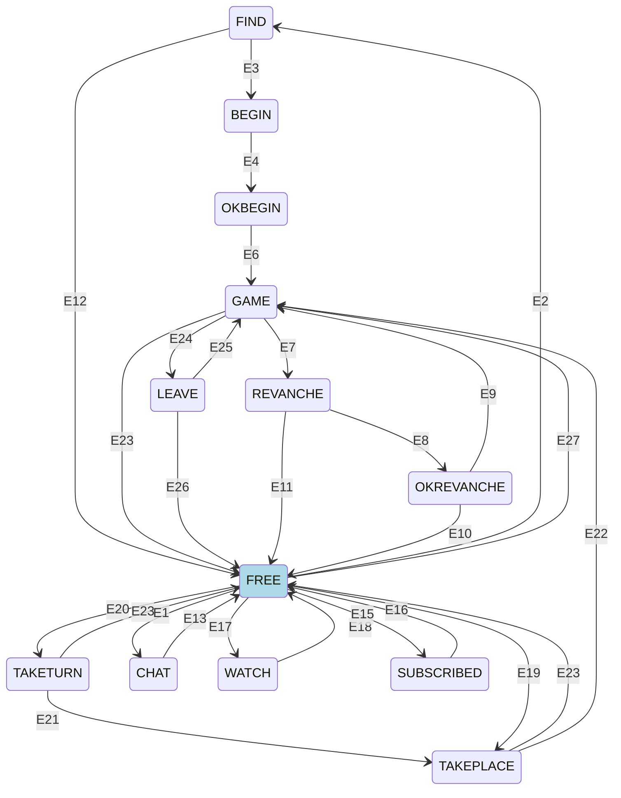

**Состояния каналов**

В каждый момент времени канал находится в одном из описанных состояний. Переходы между состояниями осуществляются только при строго определенных условиях. Клиент должен быть способен восстановить свое состояние при повторном соединении с прокси или при открытии произвольного канала.

Каждое состояние может быть доступно в двух представлениях:

- В общем списке каналов пользователя после прохождения авторизации состояние представлено в краткой форме, содержащее основную информацию о состоянии канала. Например, по краткому состоянию GAME можно определить тип игры.
- При открытии канала командой `open` возвращается полное состояние, содержащее полную информацию о состоянии канала для синхронизации с клиентом.



### События переходов

- E1 — клиент отправил запрос `chatjoin` и успешно присоединился к чату
- E2 — клиент отправил запрос `find` для начала поиска подходящей игры (матчинга)
- E3 — от лобби получено сообщение `match` о нахождении подходящих оппонентов
- E4 — клиент отправил запрос `begin` для подтверждения готовности к игре или наступил таймаут ожидания
- E6 — получено подтверждение того, что все каналы участников перешли в состояние `OKBEGIN`
- E7 — игровой процесс завершен, зафиксирован результат игры
- E8 — клиент отправил запрос `revanche` для предложения повторной игры оппонентам
- E9 — получено подтверждение того, что все каналы участников перешли в состояние `OKREVANCHE`
- E10 — время ожидания реванша истекло или запрос на реванш был отменен
- E11 — клиент отправил запрос `cancelrevanche` или истек таймаут ожидания предложения реванша
- E12 — клиент отправил запрос `findcancel` для отмены процесса поиска игры
- E13 — клиент отправил запрос `chatleave` для выхода из чат-канала
- E15 — клиент отправил запрос `subscribe` для подписки на обновления комнат в лобби
- E16 — клиент отправил запрос `unsubscribe` для отмены подписки на обновления лобби
- E17 — клиент отправил запрос `watch` для перехода в режим наблюдения за игрой
- E18 — клиент отправил запрос `unwatch` для прекращения режима наблюдения
- E19 — клиент отправил запрос `takeplace` для резервирования конкретного места за столом
- E20 — клиент отправил запрос `taketurn` для постановки в очередь на занятие места за столом
- E21 — клиент успешно переведен из очереди ожидания на заблокированное место за столом
- E22 — клиент отправил запрос `sitdown`, фактически занимая зарезервированное место
- E23 — игровая сессия окончательно завершена или принудительно прервана
- E24 — клиент отправил запрос `leave`, временно покидая игровой стол (сохраняя возможность вернуться)
- E25 — клиент отправил запрос `return` и успешно вернулся за игровой стол для продолжения игры
- E26 — игровой процесс завершился в то время, когда клиент находился в состоянии отсутствия за столом (`LEAVE`)
- E27 — клиент отправил запрос `join` для прямого подключения к текущей игровой сессии

### free

Состояние, в которое канал переходит при создании и удалении из системы. Клиент может использовать канал в таком состоянии на свое усмотрение. Состояние канала представлено всегда как:

```xml
<state value="free"/>
```

### subscribed

Состояние, в которое канал переходит при подписке на изменения в комнатах лобби.

Краткое представление:

```xml
<state value="subscribed">
  <room id="XXX"/>
</state>
```

Полное представление:

```xml
<state value="subscribed">
  <room id="xxx">
    <table id="xxx" created="yyy" players="zzz" watchers="uuu" bet="aaa"/>
    ...
  </room>
</state>
```

### find

Состояние, в которое канал переходит при начале поиска игры (матчинге). Краткое и полное представления совпадают:

```xml
<state value="find">
  <queue name="durak">
    <criteria game_type="durak_podkidnoi" num_seats="2,3" cash_bet="200,1000"/>
    <criteria game_type="durak_podkidnoi_2х2" num_seats="4" cash_bet="100,1000"/>
  </queue>
</state>
```

### begin

Состояние, в которое канал переходит при окончании матчинга и попытке начала игры. Краткое и полное представления совпадают:

```xml
<state value="begin">
  <wait name="begin" value="1000" tick="16" />
  <criteria game_type="durak_podkidnoi" cash_bet="100".../>
</state>
```

### okbegin

Состояние, в которое канал переходит при подтверждении клиентом начала игры. Краткое и полное представления совпадают:

```xml
<state value="okbegin">
  <wait name="begin" value="1000" tick="16" />
  <criteria game_type="durak_podkidnoi" cash_bet="100".../>
</state>
```

### game

Состояние, в которое канал переходит при успешном старте игры. Валюта будет присутствовать, если она указана в игровой конвенции.

Краткое представление:

```xml
<state value="game">
  <game type="XXX" currency="XXX"/>
</state>
```

Полное представление зависит от реализации игры:

```xml
<state value="game">
  <gamestate>
    <!-- состояние игры согласно протоколу игры -->
  </gamestate>
  <gameinfo id="xxx" name="xxx"/>
  <self box="xxx"/>
  <players>
    <player box="xxx" nick="yyy" avatar="zzz" timeBank="yyy" timeBankTick="iii" lvl="lll"/>
    ...
  </players>
  <watchers>
    <watcher nick="yyy" avatar="zzz">
    ...
  </watchers>
  <waits>
    <wait box="aaa" name="xxx" tick="yyy" value="zzz" timeBank="uuu"/>
    ...
  </waits>
</state>
```

### leave

Состояние, в которое канал переходит после команды `leave`. Валюта будет присутствовать, если она указана в игровой конвенции. Краткое и полное представления совпадают:

```xml
<state value="leave">
  <game type="XXX" currency="XXX"/>
</state>
```

### revanche

Состояние, в которое канал переходит после окончания игры.

Краткое представление:

```xml
<state value="revanche">
  <game type="xxx"/>
</state>
```

Полное представление:

```xml
<state value="revanche">
  <game type="xxx"/>
  <wait name="xxx" tick="yyy" value="zzz"/>
</state>
```

### okrevanche

Состояние, в которое канал переходит при согласии пользователя на реванш. Краткое и полное представления совпадают:

```xml
<state value="okrevanche">
  <game type="xxx"/>
</state>
```

### watch

Состояние, в которое канал переходит при наблюдении игры.

Краткое представление:

```xml
<state value="watch">
  <game type="xxx"/>
</state>
```

Полное представление:

```xml
<state value="watch">
  <!-- аналогичное game -->
</state>
```

### chat

Состояние, в которое канал переходит при подключении к чату.

Краткое представление:

```xml
<state value="chat" id="xxx"/>
```

Полное представление:

```xml
<state value="chat" id="xxx">
  <chat event="setup" users="xxx" topic="xxx">
    <chat event="msg" uid="xxx" ts="xxx" nick="xxx" avatar="xxx">message</chat>
    <chat event="join" uid="xxx" ts="xxx" nick="xxx" avatar="xxx"/>
    <chat event="leave" uid="xxx" ts="xxx" nick="xxx" avatar="xxx"/>
    ...
  </chat>
</state>
```

### taketurn

Состояние ожидания посадки игрока за стол.

```xml
<state value="taketurn" tableId="xxx"/>
```

`tableId` - идентификатор стола

### takeplace

Состояние блокировки места за столом.

```xml
<state value="takeplace" tableId="xxx" box="xxx"/>
```

`tableId` - идентификатор стола
